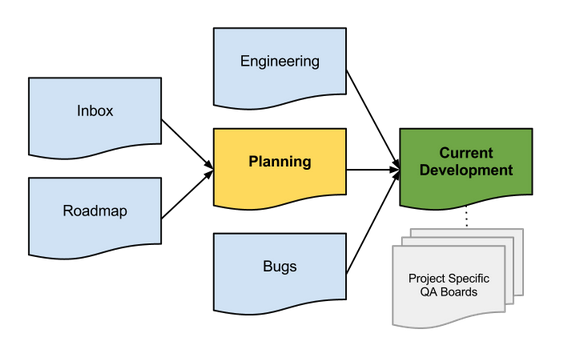

# Project Planning

For managing the Rialto project, we use Trello. The development process is divided over 6 boards, each with a specific subject (e.g. bugs, features, refactoring, etc.) within the process.

The goal is to feed cards from the other boards into the main and most important board: the **Current Development** board, and its **Next Up** column in specific. This is the column that contains the cards that will be worked on during this sprint.

## Trello Cards
A card represents a **single** story to be implemented. It could be a new feature, a refactoring task or a bug.

**Feature cards** start out as a simple idea, 1-2 sentences long. But before they can move in development they will be expanded to **include** a link to **a spec** and a set of wireframes or (rough) mock ups.

If the card is a **bug** then it **includes** the **steps to reproduce** the bug, the environment, user info etc.

[INSERT CARD PREVIEW IMAGE HERE]

## Boards
### Current Development
- **Next Up**
  - Prioritized list of all cards ready for development.
  - It is worth noting that as a developer you are not required to take the top card off the stack but rather the top card you feel most appropriate to handle.

- **In Progress**
  - These are the cards that are under active design or development.
  - Once you take a card you assign it to yourself. Dev etiquette is that you should never have your face on more than 2 cards at a time: 1 major project and 1 minor.
  - When an engineer takes a card they assign a due date on it to let others know the *expected* delivery date of this card to QA.

- **QA**
  - When the engineer thinks they have completed the story, they’ll deploy it to staging and drag the card to QA.  At this point it our QA manager is responsible for taking a look and verifying that everything looks okay for this to go live.
  - If the card is an feature project that is quite large we’ll spin up a whole new board dedicated to issues that came up during QA of that project. The project card will stay in QA until all the cards on the project specific QA board are done.

- **Pull-request**
  - These cards have been reviewed by QA and are ready to be deployed  and there’s probably a GitHub Pull Request associated with it.
  - If the card is a bug or refactoring task it will be deployed to production immediately (but not after 3pm Friday unless you, as the deployer, are willing to be around for the next 90 minutes to monitor any issues that come up).

- **Live (Week #)**
  - These cards have been deployed to production
  - Each week has it’s own Live column so we can track what got launched when.

In addition we have a couple of labels that can be applied to a card:

- Bug
- Staging *(when card is deployed to staging)*

Cards in the current development board are **always** feeded from the other boards:

### Product roadmap
This has all the major projects for each quarter looking roughly 3 quarters ahead. These big projects are moved to the Planning board once that quarter begins.

This board is managed by Rialto management and in most cases developers have no interest here.

### Inbox
- **Internal Ideas**
  -  Ideas or suggestions that come from any Rialto team member

- **Customer Ideas**
  - Ideas or suggestions that come from customers

The ideas on this board are reviewed once a week during the planning meeting.

### Bugs
- **Inbox**
  - Non-confirmed reported bugs

- **Needs input**
  - There were issues reproducing the issue and the original reporter needs to provide more info. (Don't forget to @mention).

- **Accepted**
  - Reported bug is confirmed and will be moved to either Next Up in the Current Development board, or Next Week in the Bug board, depending on how critical.

- **Next Week**
  - Bugs to be included in the Next Up in Current Development next week.
  - This column includes the bugs that will be fixed next week

If a bug moves to Accepted and is considered **Critical** by the customer team then it moves immediately to the Current Development board and the "dev on call" is alerted.

If the bug is **not critical** it stays in Accepted until the Head of Customer Service moves it into the Next Week column which is the bugs that will be fixed next week.

The caveat is that **one developer**  allowed to pick **only 4 bugs per week**.

*Why only 4 you ask? Because there are always bugs and the customer team always wants them all fixed but one of our major learnings was to set a constant throttle of how much time we’d devote to (non-critical) bug fixing.*

### Engineering
We keep a list of areas that we think might need refactoring.  Each card is a refactoring project or other non-customer-facing project.

- **Rails Backend**
- **Angular Frontend**
- **React Frontend**
- **Infrastructure**

Engineers take **small cards** when they feel like it and **add them to in progress**;
**Larger cards** need to be planned in the **Next Up** list

### Planning
The Planning board is where the product team spend the majority of their time. It is fed from **Roadmap** & **Inbox** board and has the following columns:

- **Next Up**
  - This is our roughly prioritized list of the next projects we want to spec out for development

- **Spec**
  - This means "someone needs to write a spec". The card at this point is usually just a rough idea.
  - We use Google Docs for specs and heavily rely on contextual comments to asynchronously discuss any contentious points with other members of the team. Any sufficiently complex contentious concept will be fleshed out in an impromptu design meeting (more on this in next section).

- **Design**
  - Means that the card needs a designer to take a look at it. This doesn’t necessarily mean that a wireframe or mockup will be made as the design stage isn’t just about the look of it, but very much about taking the spec requirements and ironing out design concepts, usability, workflows, and impact on existing functionality.

- **Ready**
  - We have spec that’s been reviewed by the idea creator and by the design team. We optionally have a wireframe or other needed details.

- **Next week**
  - Prioritized tickets ready to be moved to the Next Up column on Current Development (after it is reviewed at the Product Planning meeting)
  - In order to keep correct prioritisation and keep the difference between Ready and Next week columns, this column should **never contain tickets with total story points more than 15**

## Meetings

- **Every morning – Standup (10 mins)**
  - Attendees: Development & product team
  - We try to drive standups to be discussion of what people need to accomplish their task rather than a boring "I did this; I’m doing this".

- **Every(?) thursday - Product Planning (1 hour)**
  - Attendees: Product team
  - Discuss / clear up specs for tickets that need to go to estimation

- **Every friday - Estimation meeting (15-30 mins)**
  - Attendees: Development team
  - Explain & estimate tickets in Estimation column based on [Planning Poker](https://en.wikipedia.org/wiki/Planning_poker)

- **Every monday morning - Sprint planning meeting (15 mins)**
  - Attendees: Development team
  - Divide tickets to development team

## Rules

- Always **@mention** someone in a card comment if you actually want a response.

- Only add new cards to (and re-sort) the **Next Up** column **once a week**

- Try to **celebrate** what gets deployed
